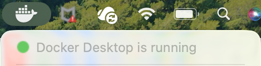
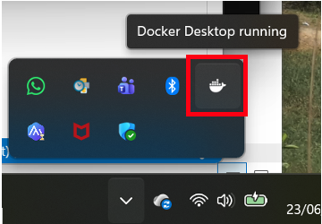
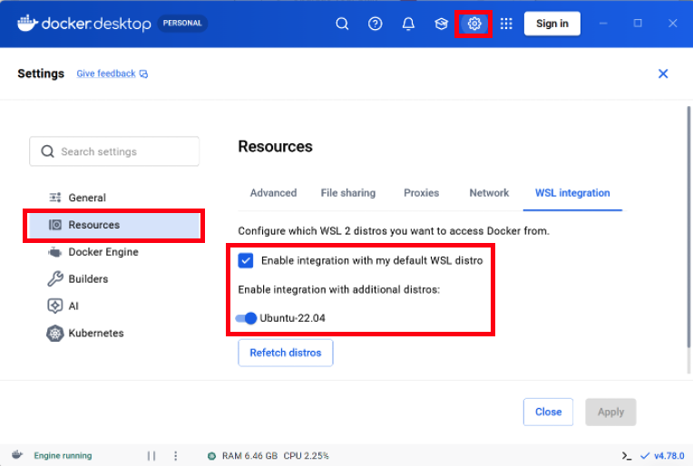
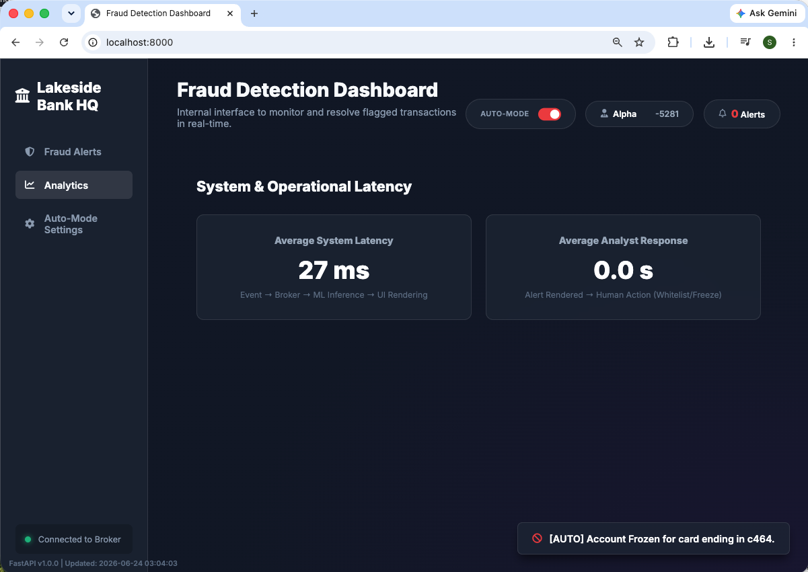
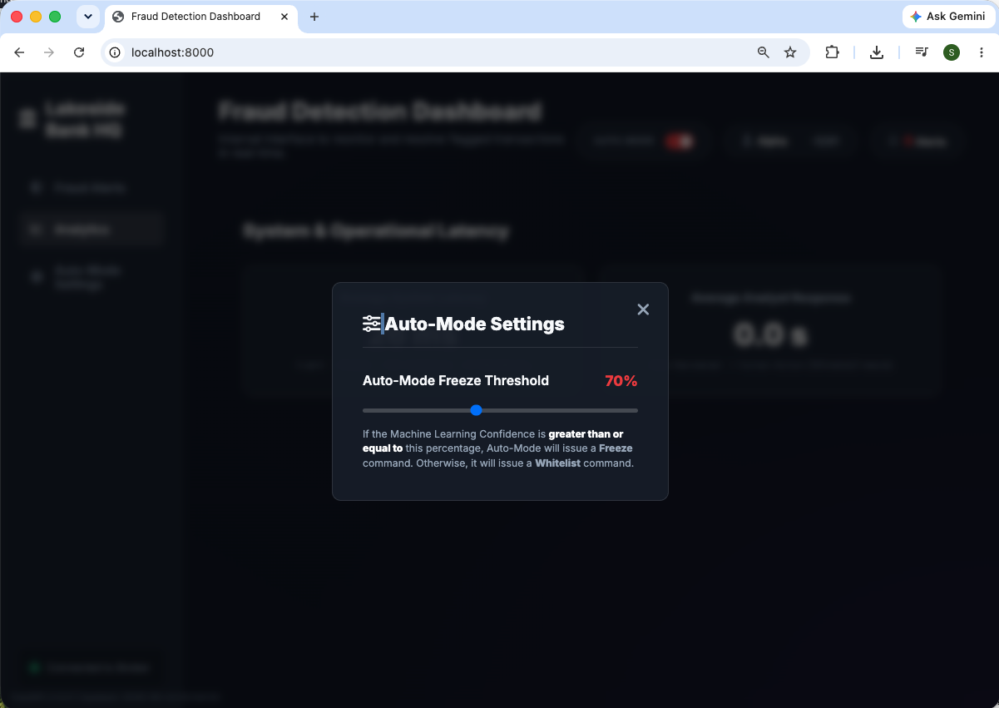
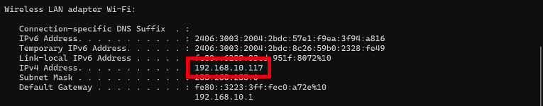

# Real-Time Streaming Pipelines (Fraud Transaction Detection)

## 📚 System Guide

This guide immerses you in the high-stakes world of **Real-Time Data Streaming**. You will build a machine learning pipeline that ingests credit card transactions as they happen and flags fraudulent activity instantly. 

The project is split into two powerful stages:
1. **Local Development:** Build the foundation using **Apache Kafka** to process streams natively on your machine.
2. **Enterprise Cloud Deployment:** Translate your architecture into a fully managed, serverless cloud environment using **Google Cloud Pub/Sub** and **Cloud Run Functions** via Terraform.


---

## <span id="toc"></span>📑 Table Of Contents (TOC)

- [0. Environment Setup](#env-setup)
- [1. System Overview & Architecture](#sys-overview)
- [2. Stage 1: Local Development (Apache Kafka)](#stage-1)
- [3. Stage 2: Enterprise Cloud Deployment (GCP Serverless)](#stage-2)
- [4. Collaboration Mode (Host the Bank HQ)](#collaboration)
- [5. System Clean-Up](#clean-up)
- [6. Inspecting Message Queues](06_INSPECTING.md)
- [7. Troubleshooting Guide](07_TROUBLESHOOTING.md)
- [8. Frequently Asked Questions (FAQ)](08_FAQ.md)
- [Appendix A: High-Performance Streaming with Redpanda](A_APPENDIX_A.md)

---

## <span id="folder-structure"></span>📂 Directory Structure

Here is a quick map of the project files to help you navigate:

```text
.
├── cloud_function/               # ML inference code deployed to GCP Cloud Run Functions
├── dashboard/                    # HTML/JS/CSS files for the Web Dashboard UI
├── data/                         # Historical dataset (fraudTest.csv)
├── images/                       # Screenshots and diagram assets for documentation
├── scripts/                      # Core Python scripts (POS terminal, FastAPI, Consumer/Producer)
├── terraform/                    # Infrastructure-as-Code for automated GCP deployment
├── docker-compose.yml            # Spin up local Apache Kafka broker
├── docker-compose-redpanda.yml   # Alternative Redpanda broker setup (See Appendix A)
├── Dockerfile                    # Docker configuration for redpanda/kafka
├── requirements.txt              # Python dependencies
├── stream-fraud-detection.yml    # Conda environment configuration file
├── README.md                     # The main guide you are reading right now!
├── 06_INSPECTING.md              # Guide on inspecting message queues
├── 07_TROUBLESHOOTING.md         # Common errors and solutions
├── 08_FAQ.md                     # Frequently asked questions
├── A_APPENDIX_A.md               # Advanced Redpanda setup guide
└── SIMULATION.md                 # Full organization role-playing architecture
```

---

## <span id="env-setup"></span><span style="color:red">📦 0. Environment Setup</span> <span style="font-size: 14px; font-weight: normal;">[⬆️ Back to TOC](#toc)</span>

### 🛠️ 0.1 Pre-requisite Software

**0.1.1 For Stage 1 (Local Apache Kafka):**
*   **Docker Desktop:** Required to run the Kafka broker locally.
    *   Mac/Windows: Download and install from [Docker's official website](https://www.docker.com/products/docker-desktop).

**0.1.2 For Stage 2 (GCP Cloud Deployment):**
*   **Google Cloud Account:** An active Google Cloud Platform (GCP) account with a new Project created and Billing enabled.
*   **Google Cloud CLI (`gcloud`):** Required to authenticate your local machine with GCP.
    *   Install Guide: [Google Cloud CLI Docs](https://cloud.google.com/sdk/docs/install)
*   **Terraform:** Required to deploy the cloud infrastructure as code.
    *   Download: [Terraform Official Download](https://developer.hashicorp.com/terraform/install)
    *   MacOS (via Homebrew):
        ```bash
        brew tap hashicorp/tap
        
        brew install hashicorp/tap/terraform
        ```
    *   Windows/WSL (Ubuntu):
        ```bash
        wget -O- https://apt.releases.hashicorp.com/gpg | sudo gpg --dearmor -o /usr/share/keyrings/hashicorp-archive-keyring.gpg
        
        echo "deb [signed-by=/usr/share/keyrings/hashicorp-archive-keyring.gpg] https://apt.releases.hashicorp.com $(lsb_release -cs) main" | sudo tee /etc/apt/sources.list.d/hashicorp.list
        
        sudo apt update && sudo apt install terraform
        ```
    *   **🪟 Windows Users (Easiest Method):** If you download the raw `.zip` from the website, extract `terraform.exe` and place it directly inside the `terraform/` folder of this project. When executing Terraform commands, use `./terraform.exe` instead of `terraform`.

**0.1.3 Verification:**
To verify that all tools are successfully installed, run the following commands in your terminal:
```bash
docker --version
gcloud --version
# Mac/WSL
terraform --version

# Windows
./terraform.exe --version
conda --version
```
If the software is installed correctly, these commands will output the currently installed version numbers.


### 🐍 0.2 Python Environment

Before starting the pipeline, set up your Python environment using Conda. This ensures all necessary libraries (Pandas, XGBoost, Kafka-Python, and Google Cloud Pub/Sub) are installed correctly.

**Instruction:**
- Run these commands in your terminal:

```bash
cd <your_stream_fraud_detection_project_path>

conda env create -f stream-fraud-detection.yml

conda activate stream-fraud-detection
```


---

## <span id="sys-overview"></span><span style="color:red">🕒 1. System Overview & Architecture</span> <span style="font-size: 14px; font-weight: normal;">[⬆️ Back to TOC](#toc)</span>

### 🚨 1.1 The Problem
Credit card fraud must be detected before the transaction settles. A scheduled batch job at midnight is useless if the thief has already walked out of the store with the TV.

### 💡 1.2 The Solution
An event-driven architecture using a Message Broker.

### 🏗️ 1.3 Architecture Flow


Architecture flow for local deployment. Apache Kafka is deployed via Docker, and the XGBoost model inference is executed continuously by a local Python consumer script (consumer_local.py).


Architecture flow for cloud deployment. Kafka is replaced by Google Cloud Pub/Sub, and the XGBoost model inference is deployed as a serverless Google Cloud Run Function.

---

## <span id="stage-1"></span><span style="color:red">💻 2. Stage 1: Local Development (Apache Kafka)</span> <span style="font-size: 14px; font-weight: normal;">[⬆️ Back to TOC](#toc)</span>

### 🛠️ 2.1 Start Apache Kafka

**Objective:** Launch the enterprise-standard message broker.

We are using Kafka in **KRaft mode**, which runs as a single self-contained broker without needing external dependencies like Zookeeper.

**Instruction:** Start the Kafka broker using Docker Compose:
```bash
docker-compose up -d
```
💡 **Tip:**
Ensure you have Docker installed and running on your system before proceeding. You can download it from [Docker's official website](https://www.docker.com/products/docker-desktop).



Ensure Docker Desktop is running in Mac environment.



Ensure Docker Desktop is running in Windows/WSL environment.


Additional check for WSL users: Make sure the **Enabled integration with my default WSL distro** setting in Settings/Resources/WSL Integration page is checked and the Ubuntu distribution is enabled.


Run `docker-compose` to start the Kafka broker.

---

### 🧠 2.2 Train the ML Model

**Objective:** Train an XGBoost model on the historical data.

📝 **Note:**
You will need to download `fraudTrain.csv` and `fraudTest.csv` from Kaggle and place them in the `data/` folder before training!
Link: [Kaggle Fraud Detection Dataset](https://www.kaggle.com/datasets/kartik2112/fraud-detection)

Open and review `scripts/train_model.py`. 

**Instruction:** Run the training script:
```bash
python scripts/train_model.py
```
Please wait for 1 to 2 minutes for this command to complete. This will generate `fraud_model.joblib`. This is the "brain" your streaming consumer will use.

📝 **Note:**
The very first time you run this script, it might take a moment to download the `fraud_model.joblib` artifact from Kafka.


After training, you will find the model file (fraud_model.joblib) in the current project folder.

---

### 📤 2.3 Start the Real-Time Pipeline

**Objective:** Simulate the real-time payment gateway and the internal fraud dashboard.

You will need **three separate terminal windows** for this step to see the full architecture in action.

#### 🖥️ Terminal 1 (The Consumer - Local):
This script listens to the Kafka **transactions** topic. It will sit idle until transactions arrive, at which point it runs them through the XGBoost model instantly.
```bash
python scripts/consumer_local.py
```


This terminal will monitor any new messages in the Kafka **transactions** topic. It will also print any messages being consumed and predicted label of the transaction.

#### 🛒 Terminal 2 (The Point of Sale Terminal - Local):
This acts as the merchant's credit card machine. It will pump transactions into Kafka.
```bash
streamlit run scripts/pos_terminal_local.py
```


The Streamlit application is now accessible in the browser via (http://localhost:8501). It simulates a merchant's credit card terminal, allowing you to generate and submit transactions for real-time fraud scoring.

💡 **Tip:**
Multi-Store Simulation: Streamlit's default port is 8501. You can simulate multiple different stores simultaneously by opening new terminal windows and running the POS Terminal on different ports! When running multiple Streamlit terminals, it is best practice to just increment sequentially from the default: 8501, 8502, 8503, 8504, etc.

```bash
streamlit run scripts/pos_terminal_local.py --server.port 8502
```


The second Streamlit application is now accessible in the browser via (http://localhost:8502).

📝 **Note:**
If you run this Streamlit POS terminal on a completely **different** computer than the one hosting your Docker Kafka broker, you will need to open your `.env` file and replace `KAFKA_BROKER="localhost:9092"` with the central computer's IP address (e.g., `KAFKA_BROKER="192.168.1.15:9092"`).

#### 🏦 Terminal 3 (The Bank's Modern Fraud Detection Dashboard - Local):
This is the FastAPI backend and web dashboard for the Fraud Analysts. It listens for alerts and serves a beautiful User Interface.
```bash
uvicorn scripts.api_local:app --host 0.0.0.0 --reload
```


Once running, open your browser to **http://localhost:8000** for the dashboard, and arrange it side-by-side with your POS Terminal. Click **"Start Transactions"** on the POS Terminal, and watch the fraud alerts flow into the web dashboard in real-time!


In the Streamlit application, click the "Start Transactions" button to start generating transactions.


In the Fraud Detection Dashboard, you will see that the transactions are being processed in real-time and automatically flagged as WHITELISTED OR FREEZE ACCOUNT.


You can also manually flag transactions as WHITELISTED OR FREEZE ACCOUNT if you disagree with the model prediction by clicking the **Override & Whitelist** or **Freeze Account** button.

### 🛑 2.4 Stop Local Pipeline (Crossing over to Cloud)

Before proceeding to the Enterprise Cloud Deployment, you need to free up your terminal windows and stop the local Python processes so they do not conflict with the cloud versions.

**Instruction:** Go back to the 3 terminal windows currently running your local Consumer, POS Terminal, and Fraud Detection Dashboard. Press `Ctrl+C` (Windows) or `Control+C` (Mac) in each terminal to stop the running Python processes. 

📝 **Note:**
For Mac users: Do not use `Cmd+C`, as that only copies text. You must use the `Control` key to stop the terminal. You can leave the Kafka Docker container running for now.

---

## <span id="stage-2"></span><span style="color:red">☁️ 3. Stage 2: Enterprise Cloud Deployment (GCP Serverless)</span> <span style="font-size: 14px; font-weight: normal;">[⬆️ Back to TOC](#toc)</span>

**Objective:** Understand how to deploy this real-time fraud detection pipeline (the streaming message broker and the ML inference consumer) into the cloud using Infrastructure as Code (Terraform) and Serverless Computing (Cloud Run Function of GCP).

In the real world, running Kafka locally does not scale. We will replace Apache Kafka with **Google Cloud Pub/Sub** and our local consumer script with a **Cloud Run Function**.

### 📦 3.1 Prepare the Deployment Package

First, copy your trained model into the `cloud_function` directory so Terraform can package it:
```bash
cd <your_stream_fraud_detection_project_path>

cp fraud_model.joblib cloud_function/
```


### ⚙️ 3.2 Configure your GCP Environment

Create an .env file from the environment variables template file:

```bash
cp .env.example .env
```

Open `.env` (with TextEdit, Notepad, VS Code, or any text editor) and update `GCP_PROJECT_ID` to your GCP project ID.


Save the changes made. For nano in Mac, press `Ctrl-X` followed by `Y` key and then `Enter` key.

Next, navigate to the `terraform` directory and copy the example variables file:
```bash
cd terraform

cp terraform.tfvars.example terraform.tfvars
```


Open `terraform.tfvars` (with TextEdit, Notepad, VS Code, or any text editor) and update your GCP Project ID there as well.


Save the changes made. For nano in Mac, press `Ctrl-X` followed by `Y` key and then `Enter` key.

### 🚀 3.3 Deploy the Infrastructure

Before deploying, you must authenticate your terminal with Google Cloud so Terraform has permission to create resources on your behalf. Run these commands:
```bash
# Log in to Google Cloud
gcloud auth login

# Set your active project
gcloud config set project <YOUR_GCP_PROJECT_ID>

# Authenticate Terraform to use your Google Cloud credentials
gcloud auth application-default login
```

Running the `gcloud auth login` will open a browser window to authenticate your terminal with Google Cloud. This is to let you use gcloud CLI commands to access resources in Google Cloud.


Running the `gcloud config set project <YOUR_GCP_PROJECT_ID>` will set the project you want to use when accessing Google Cloud.


Running the `gcloud auth application-default login` will authenticate Terraform to use your Google Cloud credentials.

Next, ensure the required Google Cloud APIs are enabled for your project. Run this command and wait 1-2 minutes for it to complete:
```bash
gcloud services enable cloudfunctions.googleapis.com cloudbuild.googleapis.com run.googleapis.com artifactregistry.googleapis.com pubsub.googleapis.com eventarc.googleapis.com
```

📝 **Note:**
Not all APIs may be enabled by default in your GCP project for security and billing reasons, so you may need to enable them first.


Run the following commands to provision the required resources (such as Pub/Sub topic, Cloud Run Function, etc) in GCP:
```bash
# Mac/WSL
terraform init

# Windows
./terraform.exe init
```


```bash
# Mac/WSL
terraform apply

# Windows
./terraform.exe apply
```


The output of the `terraform apply` command is very long. This is just the first portion of it.


Review the output of `terraform apply` and type `yes` and then `Enter` to deploy!


The last line (green colour texts) of the output of the `terraform apply` command tells you the status of the deployment: there are 12 resources deployed to GCP using terraform.

### 🚀 3.4 Launch the POS Terminal & Cloud Dashboard

To test your newly deployed Cloud Run Function, you will run the dedicated Stage 2 Cloud scripts!

Ensure you have already pressed `Ctrl+C` (or `Control+C` on Mac) in your terminal windows to stop the local scripts from Stage 1.

💡 **Optional:** You can also shut down your local Kafka broker to free up memory by running `docker-compose down`.

Because we set up the `.env` file earlier, our scripts will automatically load your `GCP_PROJECT_ID`. You will only need **two terminal windows** for this stage. Just start the cloud-native interfaces:

#### 🛒 Terminal 1 (The Point of Sale Terminal - Cloud):
```bash
streamlit run scripts/pos_terminal_cloud.py
```


Remember to click the **Start Transactions** button to start the event streaming.

💡 **Tip:**
Multi-Store Simulation: You can simulate multiple different stores simultaneously by opening new terminal windows and running the POS on different ports!
```bash
streamlit run scripts/pos_terminal_cloud.py --server.port 8502
```


#### 🏦 Terminal 2 (The Bank's Modern Fraud Detection Dashboard - Cloud):
```bash
uvicorn scripts.api_cloud:app --host 0.0.0.0 --reload
```


Fraud Detection Dashboard running in Auto-Mode. Transactions are auto-flagged as **FROZEN ACCOUNT** if the ML Confidence score is at least 70% (Default threshold set in the Dashboard Auto-Mode Settings).


Fraud Detection Dashboard running in Manual-Mode. Transactions have to be manually investigated if the ML Model prediction is not confident (less than 70%).


Click the **Analytics** button in the left-hand menu to view the analytics and insights: which tells us how much time is taken from the time the transaction event is generated at POS terminal to when it is either approved or declined by the fraud detection system.


Click the **Auto-Mode Settings** in the left-hand menu to set the threshold for the ML model confidence score. Fraud Detection Dashboard running in Auto-Mode will automatically flag the transaction as **FROZEN ACCOUNT** if the ML model confidence score is greater than or equal to the threshold (currently set to 70%). Otherwise, the transaction is auto-flagged as **WHITELISTED**.

⚠️ **Important:**
Where is the Cloud Consumer Script?
Notice that there is no consumer script to run for Stage 2! That is because the **Cloud Run Function** you just deployed via Terraform is now acting as your consumer. It automatically triggers on Pub/Sub messages and runs the ML model serverlessly in the cloud!


**💡 How to view your Cloud Consumer logs:**
1. In the GCP Console, type **"Cloud Run Functions"** in the top search bar and click on the service.
2. On the Overview page, click the name of the function you just deployed.
3. Navigate to the **Logs** tab to watch it process transactions in real-time!


---

## <span id="collaboration"></span><span style="color:red">🤝 4. Collaboration Mode (Host the Bank HQ)</span> <span style="font-size: 14px; font-weight: normal;">[⬆️ Back to TOC](#toc)</span>

Want to make this interactive? You can turn your computer into the central "Bank HQ" and invite your colleagues to help you catch fraud in real-time!

**How it Works (The Bank HQ Concept)**
Instead of everyone running their own separate dashboards, you can host a single master dashboard. When you share your local network IP address with your team, anyone can open their browser and instantly see your live fraud alerts. If a colleague clicks "Freeze" on their phone or laptop, that command is instantly sent back to your computer and flashes on your Point of Sale (POS) terminal!

📝 **Note:**
To expand this into a structured exercise across a larger team, refer to Section 4.1 below.

**Step-by-Step Setup:**

1. **Find your Local IP Address:**
   First, you need to find out what your computer's "IP address" is on the local network (e.g. `192.168.10.111`).
   - **Mac:** Open your terminal and type: `ipconfig getifaddr en0`

   

   - **Windows:** Open the **Command Prompt** terminal and type `ipconfig`. Look for the "IPv4 Address" under your active Wi-Fi connection.

   

2. **Start the Central Web Server (FastAPI):**
   Start your FastAPI web server just like before, but this time we will add `--host 0.0.0.0` to the command. This special flag tells your computer to "open the doors" and allow incoming connections from your local network.
   * **For Stage 1 (Local Kafka):**
     ```bash
     uvicorn scripts.api_local:app --host 0.0.0.0 --port 8000
     ```
   * **For Stage 2 (Cloud Pub/Sub):**
     ```bash
     uvicorn scripts.api_cloud:app --host 0.0.0.0 --port 8000
     ```

3. **Invite Your Team:**
   Tell your team members to connect to the same Wi-Fi network as you. Then, have them open their web browsers and type your IP address followed by `:8000`.
   Example: `http://192.168.10.111:8000`

That's it! Watch the transactions flow in and let your team help you resolve them! (If your team cannot connect, the local network might have a security block. See [Section 7.6 in the Troubleshooting Guide](07_TROUBLESHOOTING.md#7-6-networking) for easy workarounds!)

### 🧑‍🤝‍🧑 4.1 Organization Simulation Setup (Optional)

💡 **Tip:**
If you have extra time and a large enough team, you can expand this basic collaboration into a fully structured simulation by assigning specific "Roles" (Data Engineer, Retail Merchant, ML Engineer, Fraud Analyst) to different team members!
**[👉 Click here to view the Full Organization Simulation Guide & Architecture Chart!](SIMULATION.md)**

---

## <span id="clean-up"></span><span style="color:red">🏁 5. System Clean-Up</span> <span style="font-size: 14px; font-weight: normal;">[⬆️ Back to TOC](#toc)</span>

**Cleanup:** When you are finished, clean up both your local and cloud environments to free up memory and avoid GCP charges:

1. **Local Cleanup:** Shut down your Kafka broker:
```bash
docker-compose down
```


2. **Cloud Cleanup:** Destroy your GCP infrastructure:
```bash
cd terraform

# Mac/WSL
terraform destroy

# Windows
./terraform.exe destroy
```


